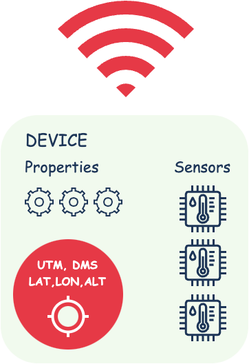
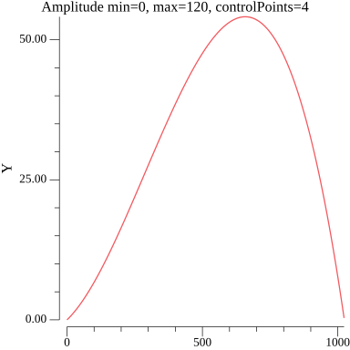
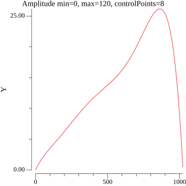
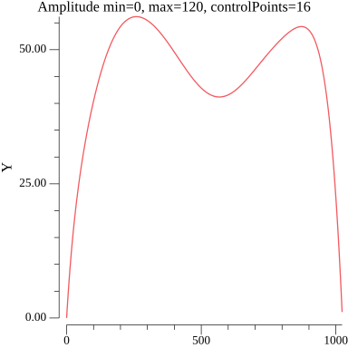
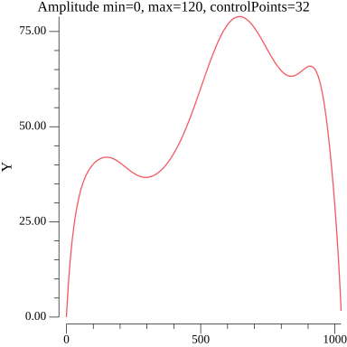
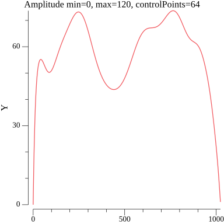
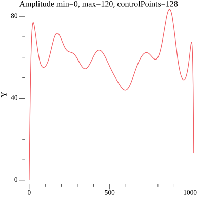
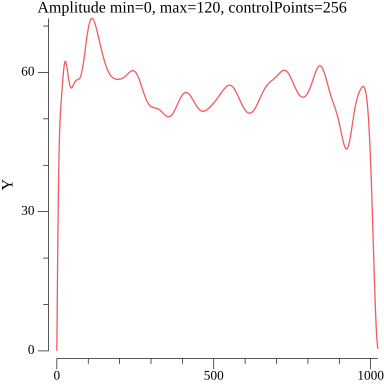
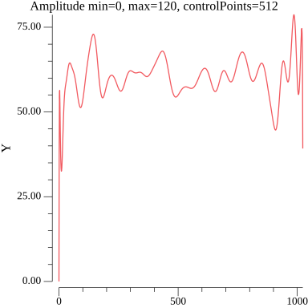

<h1 align="center">
  
  <br>
  GPSGen
  <br>
</h1>

Language: [RU](./README_ru.md)

GPS data generator based on given routes.

The library can be used in testing and debugging GPS dependent applications or devices, allowing you to create simulated locations to test their functionality without having to actually move.

## Table of contents
+ [Examples](#examples)
+ [Install](#install) 
+ [Generated data](#generated-data)
+ [Limits and base units](#limits-and-base-units)
+ [Settings](#settings)
+ [Routes](#routes)
   - [GeoJSON](#geojson)
   - [GPX](#gpx)
   - [Random](#random)
   - [Static](#static)
   - [Standard](#standard)
+ [Device presets](#device-presets)   


### Examples
[Examples](./examples/)

```go
package main

import (
	"github.com/mmadfox/go-gpsgen"
	"github.com/mmadfox/go-gpsgen/draw"
	"github.com/mmadfox/go-gpsgen/route"
)

func main() {
	myRoute, err := route.Russia2()
	if err != nil {
		panic(err)
	}

	myDevice, err := gpsgen.NewDevice(
		gpsgen.WithModel("myModel"),
		gpsgen.WithDescritpion("some description"),
		gpsgen.WithElevation(1, 3, 4),
		gpsgen.WithSpeed(1, 7, 64),
		gpsgen.WithOffline(1, 120),
		gpsgen.WithBattery(0, 100),
		gpsgen.WithProps(gpsgen.Properties{
			"foo": "foo",
			"bar": "bar",
		}),
		gpsgen.WithUserID("12345678"),
		gpsgen.WithSensors(
			gpsgen.Sensor{Name: "s1", Min: 1, Max: 10, Amplitude: 8},
			gpsgen.Sensor{Name: "s2", Min: 3, Max: 10, Amplitude: 128}),
		gpsgen.WithRoute(myRoute),
	)
	if err != nil {
		panic(err)
	}

	myDevice.OnStateChange = func(state *gpsgen.State, snapshot []byte) {
		draw.Table(state)
	}

	gen := gpsgen.New()
	gen.Attach(myDevice)

	gen.Run()
	defer gen.Close()

	select {}
}
```

### Install
```shell
$ go get github.com/mmadfox/go-gpsgen
```

### Generated data
| Name              | Data                                        |
|-------------------|---------------------------------------------|
| Device            | model, description, properties              |
| Distance (meters) | total, current                              |
| Speed (m/s)       | current speed                               |
| Navigator         | lat, lon, alt, bearing, DMSLat, DMSLon, UTM |
| Sensor            | value_x, value_y, name                      |
| Status            | online, offline                             |
| User              | custom id, tick                             |

### Limits and base units
| Option        | Constraint                          | Unit             |
|---------------|-------------------------------------|------------------|
| WithSpeed     | min=0, max=1000, amplitude=4..512   | meter per second |
| WithBattery   | min=0, max=100                      | percent          |
| WithModel     | min=1, max=64                       |                  |
| WithElevation | min=0, max=100000, amplitude=4..512 | meters           |
| WithOffline   | min=0, max=300                      | seconds          |
| WithSensors   | amplitude=4..512                    | any              |


### Settings
| Option                | Description                                                                                     |
|-----------------------|-------------------------------------------------------------------------------------------------|
| With Model | Device model name (TxNo12-Oi7) |
| WithUserID | User data (ID, Number, etc) |
| WithRoutes, WithRoute | Route for the generator |
| WithSpeed | Speed range min..max in meters per second |
| WithBattery | Battery charge range 0..100 in percent |
| With Sensors | Additional sensors that can be added to the device. Sensor{name, min, max, amplitude} |
| WithElevation | Height range min..max in meters |
| WithOffline | Between switching tracks or routes, the device will go offline min..max in seconds |
| WithProps | Device characteristics map[string]string |
| With Description | Short description of the device |

### Routes
A route for a GPX generator is a given path or a sequence of points on the map that determines the planned or fixed movement of the geotracker.

#### GeoJSON
```go
package main

import (
	"github.com/mmadfox/go-gpsgen"
	"github.com/mmadfox/go-gpsgen/geojson"
)

func main() {
	geoJSONRoute := `{"type":"FeatureCollection","features":[{"type":"Feature","properties":{},"geometry":{"coordinates":[[37.73185507353088,55.59010742814678],[37.740460827380986,55.585012323942266]],"type":"LineString"}}]}`
	routes, err := geojson.Decode([]byte(geoJSONRoute))
	if err != nil {
		panic(err)
	}
	myTracker, err := gpsgen.Tracker("Tracker78-1", nil, routes...)
	if err != nil {
		panic(err)
	}
	_ = myTracker
}
```

#### GPX
```go 
package main

import "github.com/mmadfox/go-gpsgen/gpx"

func main() {
	gpxRoute := `<?xml version="1.0" encoding="UTF-8"?><gpx xmlns="http://www.topografix.com/GPX/1/1"
   version="1.1"
   creator="Wikipedia" xmlns:xsi="http://www.w3.org/2001/XMLSchema-instance"
   xsi:schemaLocation="http://www.topografix.com/GPX/1/1 http://www.topografix.com/GPX/1/1/gpx.xsd"><time>2011-09-22T18:56:51Z</time><metadata><name>Name</name><desc>Description</desc><author><name>Autor</name></author></metadata><rte><rtept lat="55.74966429698134" lon="37.624339525581576"/><rtept lat="55.748482140161286" lon="37.62444198526788"/></rte></gpx>`

	routes, err := gpx.Decode([]byte(gpxRoute))
	if err != nil {
		panic(err)
	}
	_ = routes
}
```

#### Random
Supported countries: ```Angola, SouthArabia, Turkey, Russia, France, Spain, China```
```go 
package main

import "github.com/mmadfox/go-gpsgen/route"

func main() {
	myRoute, err := route.Generate()
	if err != nil {
		panic(err)
	}
	_ = myRoute

    // by specified country 
	myRoute1, err := route.GenerateFor(route.Russia)
	if err != nil {
		panic(err)
	}
	_ = myRouteR1
}
```

#### Static
Supported countries: ```Russia 1..5, France 1..5, Spain 1..5, China1..5```
```go
package main

import "github.com/mmadfox/go-gpsgen/route"

func main() {
	_, _ = route.China1()
	_, _ = route.China2()
	_, _ = route.China3()
	_, _ = route.China4()
	_, _ = route.China5()

	_, _ = route.France1()
	_, _ = route.France2()
	_, _ = route.France3()
	_, _ = route.France4()
	_, _ = route.France5()

	_, _ = route.Spain1()
	_, _ = route.Spain2()
	_, _ = route.Spain3()
	_, _ = route.Spain4()
	_, _ = route.Spain5()

	_, _ = route.Russia1()
	_, _ = route.Russia2()
	_, _ = route.Russia3()
	_, _ = route.Russia4()
	_, _ = route.Russia5()
}
```

#### Standard
```go
package main

import "github.com/mmadfox/go-gpsgen/navigator"

func main() {
	r1, err := navigator.NewRoute([][]navigator.Point{
		{ // Track-1
			{X: 55.748482140161286, Y: 37.62444198526788}, // X - lat, Y - lon
			{X: 55.74863130542925, Y: 37.62442905718493},  // X - lat, Y - lon
            // ...
		},
        { // Track-2
            // ...
        }
	})
	if err != nil {
		panic(err)
	}
	_ = r1
}
```

### Device Presets
```go 
// Drone 
gpsgen.Drone(model string, props gpsgen.Properties, route ...*navigator.Route) (*gpsgen.Device, error)
gpsgen.DroneWithSensors( model string, routes []*navigator.Route, props gpsgen.Properties, sensors ...gpsgen.Sensor) (*gpsgen.Device, error)

// Tracker
gpsgen.Tracker( model string, props gpsgen.Properties, route ...*navigator.Route) (*gpsgen.Device, error)
gpsgen.TrackerWithSensors( model string, routes []*navigator.Route, props gpsgen.Properties, sensors ...gpsgen.Sensor) (*gpsgen.Device, error)
``` 

### Amplitude option example
The figures show random values from 0 to 120 and control points 4,8,16,32,64,128,256,512










