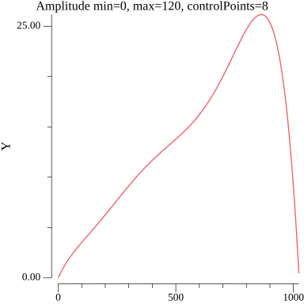
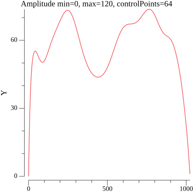

<h1 align="center">
  
  <br>
  GPSGen
  <br>
</h1>

Language: [En](./README.md)

Генератор GPS данных на основе заданных маршрутов.

Библиотека может использоваться в тестировании и отладке приложений или устройств, зависящих от GPS, позволяя создавать симулированные местоположения для проверки их функциональности без необходимости фактического перемещения.

## Оглавление
+ [Примеры](#примеры)
+ [Установка](#установка)
+ [Генерируемые данные](#генерируемые-данные)
+ [Ограничения и базовые единицы](#ограничения-и-базовые-единицы)
+ [Настройки](#настройки)
+ [Маршруты](#маршруты)
  - [GeoJSON](#geojson)
  - [GPX](#gpx)
  - [Рандомные](#рандомный)
  - [Статичные](#cтатичный)
  - [Стандартный](#стандартный)
+ [Пресеты устройств](#пресеты-устройств)  
+ [Настройка amplitude](#пример-amplitude-option)


### Примеры
[Examples](./examples/)

```go
package main

import (
	"github.com/mmadfox/go-gpsgen"
	"github.com/mmadfox/go-gpsgen/draw"
	"github.com/mmadfox/go-gpsgen/proto"
)

func main() {
	conf := gpsgen.NewConfig()

	myDevice, err := conf.NewDevice()
	if err != nil {
		panic(err)
	}
	myDevice.OnStateChange = func(state *proto.Device) {
		draw.Table(state)
	}

	gen := gpsgen.New()
	gen.Attach(myDevice)
	gen.Run()
	defer gen.Close()

	select {}
}
```
### Установка
```shell
$ go get github.com/mmadfox/go-gpsgen
```

### Генерируемые данные
```shell
+---------------------------+--------------------------------+--------------------------------+--------------------------------+
|          DEVICE           |            LOCATION            |            SENSORS             |         CUSTOM SENSORS         |
+---------------------------+--------------------------------+--------------------------------+--------------------------------+
| Model:myModel             | Lon:37.510157 Lat:55.806540    | Speed:1.01m/s                  | s1:valX=0.000875 valY=1.685227 |
| Status:Online             | Elevation:2.501655m            | BatteryCharge:99.99%           | s2:valX=0.015872 valY=3.767889 |
| RouteIndex:0              | Bearing:118.180068             | ChargeTime:4h0m0s              |                                |
| TrackIndex:0              | DMSLat:55°48'23.543422"N       | Duration:1s                    |                                |
| SegmentIndex:0            | DMSLon:37°30'36.564914"E       | TotalDist:32006.99m.           |                                |
| Descr:some description    | UTMEasting:406621.9896         | CurDist:1.01m.                 |                                |
| Properties:               | UTMNorthing:6185552.6145       | CurSegDist:1.01m.              |                                |
| foo=foo,bar=bar,          | UTMZone:37U                    | SegDist:1521.11m.              |                                |
|                           |                                | Tick:9223372036.85s            |                                |
+---------------------------+--------------------------------+--------------------------------+--------------------------------+
```

### Ограничения и базовые единицы
| Option        | Constraint                          | Unit             |
|---------------|-------------------------------------|------------------|
| WithSpeed     | min=0, max=1000, amplitude=4..512   | meter per second |
| WithBattery   | min=0, max=100, chargeTime          | percent          |
| WithModel     | min=1, max=64                       |                  |
| WithElevation | min=0, max=10000, amplitude=4..512  | meters           |
| WithOffline   | min=0, max=300                      | seconds          |
| WithSensors   | min=0, max=15, amplitude=4..512     | any              |
#### Ограничения для устройства
```json
{"model":{"min":1,"max":64},"properties":{"min":0,"max":16,"maxValueLen":64,"minKeyLen":32},"description":{"min":3,"max":256},"speed":{"max":1000,"min":0,"amplitudeMin":4,"amplitudeMax":512},"battery":{"max":100,"min":0},"elevation":{"max":10000,"min":0,"amplitudeMin":4,"amplitudeMax":512},"offline":{"min":0,"max":900},"sensors":{"min":0,"max":15},"routes":{"min":1,"max":10,"minTracksPerRoute":1,"maxTracksPerRoute":128,"minSegmentsPerTrack":1,"maxSegmentsPerTrack":1000,"minDistance":1000,"maxDistance":2000000}}
```

### Настройки
| Option                | Description                                                                                     |
|-----------------------|-------------------------------------------------------------------------------------------------|
| WithModel             | Название модели устройства (TxNo12-Oi7)                                                         |
| WithUserID            | Данные пользователя (ID, Number, etc)                                                           |
| WithRoutes, WithRoute | Маршрут для генератора                                                                          |
| WithSpeed             | Диапазон скорости min..max в метрах в секунду                                                   |
| WithBattery           | Диапазон заряда аккумулятора 0..100 в процентах                                                 |
| WithSensors           | Дополнительные датчики, которые можно добавить к устройству. Sensor{name, min, max, amplitude}  |
| WithElevation         | Диапазон высоты min..max в метрах                                                               |
| WithOffline           | Между переключением треков или маршрутов устройство будет уходить в offline min..max в секундах |
| WithProps             | Характеристики устройства map[string]string                                                     |
| WithDescritpion       | Короткое описание устройства                                                                    |

### Маршруты
Маршрут для GPS генератора - это заданный путь или последовательность точек на карте, которые определяют планируемое или фиксированное перемещение геотрекера. 
#### GeoJSON
```go
package main

import (
	"github.com/mmadfox/go-gpsgen"
	"github.com/mmadfox/go-gpsgen/geojson"
)

func main() {
	geoJSONRoute := `{"type":"FeatureCollection","features":[{"type":"Feature","properties":{},"geometry":{"coordinates":[[37.73185507353088,55.59010742814678],[37.740460827380986,55.585012323942266]],"type":"LineString"}}]}`
	routes, err := geojson.Decode([]byte(geoJSONRoute))
	if err != nil {
		panic(err)
	}
	myTracker, err := gpsgen.Tracker("Tracker78-1", nil, routes...)
	if err != nil {
		panic(err)
	}
	_ = myTracker
}
```
#### GPX
```go 
package main

import "github.com/mmadfox/go-gpsgen/gpx"

func main() {
	gpxRoute := `<?xml version="1.0" encoding="UTF-8"?><gpx xmlns="http://www.topografix.com/GPX/1/1"
   version="1.1"
   creator="Wikipedia" xmlns:xsi="http://www.w3.org/2001/XMLSchema-instance"
   xsi:schemaLocation="http://www.topografix.com/GPX/1/1 http://www.topografix.com/GPX/1/1/gpx.xsd"><time>2011-09-22T18:56:51Z</time><metadata><name>Name</name><desc>Description</desc><author><name>Autor</name></author></metadata><rte><rtept lat="55.74966429698134" lon="37.624339525581576"/><rtept lat="55.748482140161286" lon="37.62444198526788"/></rte></gpx>`

	routes, err := gpx.Decode([]byte(gpxRoute))
	if err != nil {
		panic(err)
	}
	_ = routes
}
```
#### Рандомный
Поддерживаются страны: ```Angola, SouthArabia, Turkey, Russia, France, Spain, China```
```go 
package main

import "github.com/mmadfox/go-gpsgen/route"

func main() {
	myRoute, err := route.Generate()
	if err != nil {
		panic(err)
	}
	_ = myRoute

    // by specified country 
	myRoute1, err := route.GenerateFor(route.Russia)
	if err != nil {
		panic(err)
	}
	_ = myRouteR1
}
```
#### Cтатичный
Поддерживаются страны: ```Russia1..5, France1..5, Spain1..5, China1..5``` 
```go
package main

import "github.com/mmadfox/go-gpsgen/route"

func main() {
	_, _ = route.China1()
	_, _ = route.China2()
	_, _ = route.China3()
	_, _ = route.China4()
	_, _ = route.China5()

	_, _ = route.France1()
	_, _ = route.France2()
	_, _ = route.France3()
	_, _ = route.France4()
	_, _ = route.France5()

	_, _ = route.Spain1()
	_, _ = route.Spain2()
	_, _ = route.Spain3()
	_, _ = route.Spain4()
	_, _ = route.Spain5()

	_, _ = route.Russia1()
	_, _ = route.Russia2()
	_, _ = route.Russia3()
	_, _ = route.Russia4()
	_, _ = route.Russia5()
}
```
#### Стандартный
```go
package main

import "github.com/mmadfox/go-gpsgen/navigator"

func main() {
	r1, err := navigator.NewRoute([][]navigator.Point{
		{ // Track-1
			{X: 55.748482140161286, Y: 37.62444198526788}, // X - lat, Y - lon
			{X: 55.74863130542925, Y: 37.62442905718493},  // X - lat, Y - lon
            // ...
		},
        { // Track-2
            // ...
        }
	})
	if err != nil {
		panic(err)
	}
	_ = r1
}
```
### Пресеты устройств
```go 
// Drone 
gpsgen.Drone(model string, props gpsgen.Properties, route ...*navigator.Route) (*gpsgen.Device, error)
gpsgen.DroneWithSensors( model string, routes []*navigator.Route, props gpsgen.Properties, sensors ...gpsgen.Sensor) (*gpsgen.Device, error)

// Tracker
gpsgen.Tracker( model string, props gpsgen.Properties, route ...*navigator.Route) (*gpsgen.Device, error)
gpsgen.TrackerWithSensors( model string, routes []*navigator.Route, props gpsgen.Properties, sensors ...gpsgen.Sensor) (*gpsgen.Device, error)
``` 
### Пример amplitude option
Все датчики формируют данные от минимального до максимального значения по кривой Безье с учетом контрольных точек, которые указаны в параметре амплитуды.
Амплитуда – это количество контрольных точек на кривой Безье от 4 до 512.

На рисунках представлены рандомные значения от 0 до 120 и контрольные точки 4,8,16,32,64,128,256,512








